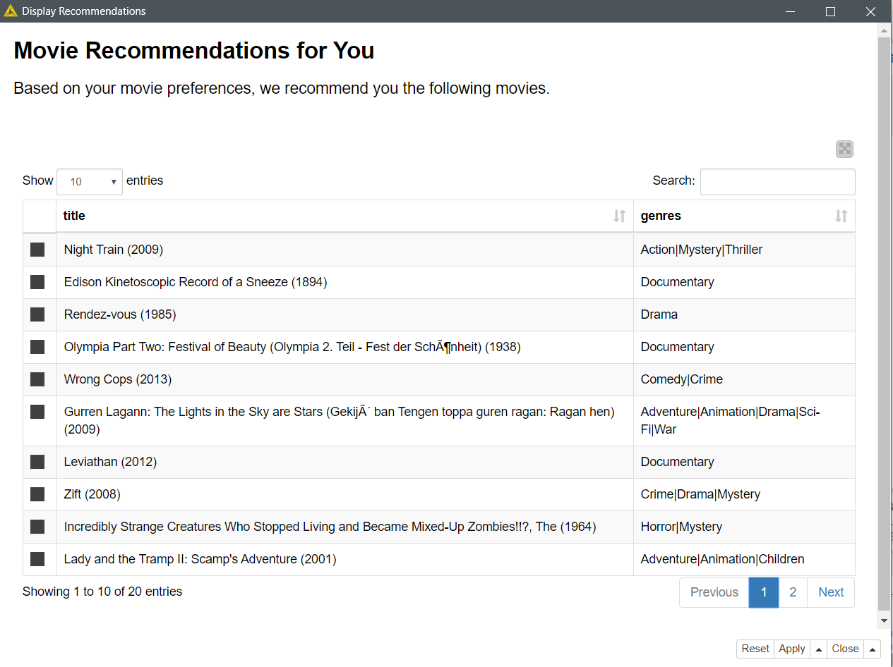
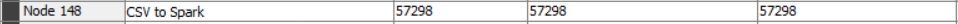

# Dokumentasi Movie Recommendation Engine menggunakan Apache Spark (KNIME)
## Daftar Isi
- [Business Understanding](https://github.com/bimaramadhan/bigdata-its-2020/tree/master/tugas3#business-understanding)
- [Data Understanding](https://github.com/bimaramadhan/bigdata-its-2020/tree/master/tugas3#data-understanding)
- [Data Preparation](https://github.com/bimaramadhan/bigdata-its-2020/tree/master/tugas3#data-preparation)
- [Modeling](https://github.com/bimaramadhan/bigdata-its-2020/tree/master/tugas3#modeling)
- [Evaluation](https://github.com/bimaramadhan/bigdata-its-2020/tree/master/tugas3#evaluation)
- [Deployment](https://github.com/bimaramadhan/bigdata-its-2020/tree/master/tugas3#deployment)
- [Workflow KNIME](https://github.com/bimaramadhan/bigdata-its-2020/tree/master/tugas3#workflow-knime)
- [Perbandingan Waktu yang Diperlukan File Reader dan CSV to Spark untuk Membaca File](https://github.com/bimaramadhan/bigdata-its-2020/tree/master/tugas3#perbandingan-waktu-yang-diperlukan-file-reader-dan-csv-to-spark-untuk-membaca-file)

# Business Understanding
Kemungkinan proses yang dapat dilakukan pada dataset ini antara lain :
- Melihat daftar film terbaik berdasar data rating yang ada
- Mengelompokkan film berdasarkan genre yang diinginkan
- Melihat daftar film populer pada tiap genre
- Membuat sistem rekomendasi film

# Data Understanding

- Dataset yang digunakan adalah kumpulan data yang menampung rating berbasis 5-bintang berjumlah 20000263 rating, dan 465564 tag dari keseluruhan 27278 film. Data menampung rating dari 138493 user sejak tanggal 9 Januari 1995 sampai 31 Maret 2015. Dataset ini sendiri dibuat pada 17 Oktober 2016.

- Dataset ini berisi 6 file, genome-scores.csv, genome-tags.csv, links.csv, movies.csv, ratings.csv dan tags.csv

- **Ratings Data File Structure (ratings.csv)**
  - Semua peringkat ada di file ratings.csv. Setiap baris file ini setelah baris tajuk mewakili satu peringkat satu film oleh satu pengguna, dan memiliki format berikut: userId, movieId, rating, timestamp
  - Baris-baris di dalam file ini diurutkan terlebih dahulu dari userId, lalu, di dalam pengguna, oleh movieId.
  - Peringkat dibuat pada skala 5 bintang, dengan peningkatan setengah bintang (0,5 bintang - 5,0 bintang).
  - Timestamp mewakili detik sejak tengah malam Waktu Universal Terkoordinasi (UTC) 1 Januari 1970.

- **Tags Data File Structure (tags.csv)**
  - Semua tag terdapat dalam file tags.csv. Setiap baris file ini setelah baris tajuk mewakili satu tag yang diterapkan pada satu film oleh satu pengguna, dan memiliki format berikut: userId, movieId, tag, cap waktu
  - Baris-baris di dalam file ini diurutkan terlebih dahulu dari userId, lalu, di dalam pengguna, oleh movieId.
  - Tag adalah metadata yang dibuat pengguna tentang film. Setiap tag biasanya satu kata atau frasa pendek. Arti, nilai, dan tujuan dari tag tertentu ditentukan oleh setiap pengguna.
  - Timestamp mewakili detik sejak tengah malam Waktu Universal Terkoordinasi (UTC) 1 Januari 1970.

- **Movies Data File Structure (movies.csv)**
  - Informasi film terdapat dalam file movies.csv. Setiap baris file ini setelah baris tajuk mewakili satu film, dan memiliki format berikut: movieId, judul, genre
  - Judul film dimasukkan secara manual atau diimpor dari https://www.themoviedb.org/, dan termasuk tahun rilis dalam tanda kurung. Kesalahan dan ketidakkonsistenan mungkin ada dalam judul-judul ini.

- **Links Data File Structure (links.csv)**
  - Pengidentifikasi yang dapat digunakan untuk menautkan ke sumber data film lain terkandung dalam file links.csv. Setiap baris file ini setelah baris tajuk mewakili satu film, dan memiliki format berikut: movieId, imdbId, tmdbId
  - movieId adalah pengidentifikasi untuk film yang digunakan oleh https://movielens.org. Misal, film Toy Story memiliki tautan https://movielens.org/movies/1.
  - imdbId adalah pengidentifikasi untuk film yang digunakan oleh http://www.imdb.com. Misal, film Toy Story memiliki tautan http://www.imdb.com/title/tt0114709/.
  - tmdbId adalah pengidentifikasi untuk film yang digunakan oleh https://www.themoviedb.org. Misal, film Toy Story memiliki tautan https://www.themoviedb.org/movie/862.

- **Tag Genome (genome-scores.csv and genome-tags.csv)**
  - Tag Genome adalah struktur data yang berisi skor relevansi tag untuk film. Strukturnya adalah matriks padat: setiap film dalam genom memiliki nilai untuk setiap tag dalam genome.
  - Seperti yang dijelaskan dalam artikel ini, tag genome mengkodekan seberapa kuat film menunjukkan properti tertentu yang diwakili oleh tag (atmosfer, pemicu pemikiran, realistis, dll.). Tag genome dihitung menggunakan algoritma pembelajaran mesin pada konten kontribusi pengguna termasuk tag, peringkat, dan ulasan tekstual.
  - Genome dibagi menjadi dua file. File genome-score.csv berisi data relevansi tag-film dalam format berikut: movieId, tagId, relevansi
  - File kedua, genome-tags.csv, memberikan deskripsi tag untuk ID tag dalam file genome, dalam format berikut: tagId, tag
  - Nilai-nilai tagId dihasilkan ketika set data diekspor, sehingga mereka dapat bervariasi dari versi ke versi set data MovieLens.

- Sumber : [MovieLens 20M Dataset](https://grouplens.org/datasets/movielens/)

# Data Preparation

- Pertama membuat spark context menggunakan node **Create Local Big Data Environment**

  

- Melakukan konfigurasi pada node tersebut
  
- Kemudian disini membangun profil user dengan id misal adalah 999999 untuk menilai 20 film acak
  
- Melakukan konfigurasi pada node **File Reader** untuk membaca data movies.csv
  
- Menambahkan node **add fields**. Didalam **add fields** terdapat beberapa proses seperti gambar di bawah ini
  
  - node **Shuffle** untuk mengacak urutan baris pada data
  - melakukan konfigurasi pada node **Constant Value Column** untuk menambahkan kolom timestamp=123 dan userID=999999
    
    
- Melakukan konfigurasi pada node **Row Splitter** untuk mengambil 20 film yang akan dinilai oleh user sedangkan film sisanya nanti akan digunakan saat proses **Deployment**
  
- Menambahkan node **no rating** yang di dalamnya terdapat beberapa node seperti berikut
  
- Proses pada node tersebut untuk menyiapkan data saat **Deployment** nanti
- Kemudian menambahkan node **Ask User for Movie Ratings** yang mana terdapat beberapa node di dalamnya yang intinya adalah untuk memberikan rating pada 20 film yang sudah diambil
  
- Berikut hasilnya jika kita klik interactive view
  
- Menambahkan node **Table to Spark** untuk membuat dataframe spark dari data table yang sudah ada rating dari user untuk digunakan saat proses **Training**
  
- Proses selanjutnya yaitu membaca file ratings.csv dengan node **CSV to Spark** untuk kemudian digunakan saat proses **Training**
  
- Melakukan konfigurasi pada node **CSV to Spark** untuk membuat dataframe spark dari file ratings.csv
  
- Melakukan konfigurasi pada node **Spark Partitioning** untuk mempartisi file dan menggunakan 80% untuk **Training** dan 20% untuk **Testing**
  

# Modeling

- Proses **Modeling** diawali dengan menggabungkan dua data menggunakan node **Spark Concatenate** yaitu data rating dan data film yang sudah diberi rating oleh user dengan konfigurasi training set=80% original movies + 20 movies rated by user
  
- Lalu Menambahkan node **Spark Collaborative Filtering Learner (MLlib)** dan lakukan konfigurasi untuk training dengan model algoritma ALS 
  

# Evaluation

- Kemudian melakukan **Testing** untuk Proses **Evaluasi** model dengan test set=20% original movies yang didapat dari proses partisi node **Spark Partitioning** 
  
- Melakukan konfigurasi node **Spark Predictor (MLlib)** untuk melakukan prediksi rating pada test set dan meletakkannya pada kolom prediction
  
- Berikut tampilan contoh hasil dari prediksi pada test set
  
- Melakukan konfigurasi pada node **Spark Missing Value** untuk menghapus NaN dan prediksi yang kosong
  
- Melakukan konfigurasi pada node **Spark Numeric Scorer** menghitung kesalahan numerik antara original ratings dan predicted ratings
  
- Berikut hasil perhitungan dapat dilihat pada gambar di bawah
   

# Deployment

- Terakhir yaitu proses **Deployment** untuk membuat prediksi 20 terbaik film untuk user
   
- Pertama menambahkan node **Table to Spark** untuk membuat dataframe spark dari data film yang tidak diberikan rating oleh user
   
- Melakukan konfigurasi node **Spark Predictor (MLlib)** untuk melakukan prediksi rating pada unrated movies dan meletakkannya pada kolom prediction
   
- Menambahkan node **Spark to Table** untuk memuat data dari dataframe spark ke data table 
- Menambahkan node **Top 20 recommended movies** yang di dalamnya terdapat node-node seperti berikut
   
- Proses pada node-node di atas adalah untuk mengurutkan rekomendasi film berdasarkan rating yang terbaik dan mengekstraknya sebanyak 20 film terbaik
- Menambahkan node **Display Recommendations** yang mana terdapat beberapa node di dalamnya
   
- Fungsi node tersebut adalah untuk menampilkannya pada portal web hasilnya adalah seperti berikut
   
- Menambahkan node **CSV Writer** dan melakukan konfigurasi untuk menyimpannya dalam bentuk file csv
   
- Berikut file telah terbuat
   

# Workflow KNIME
 

# Perbandingan Waktu yang Diperlukan File Reader dan CSV to Spark untuk Membaca File

- Untuk melakukan perbandingan node **File Reader** dan **CSV to Spark**, ditambahkan node **Timer Info** seperti berikut
   
- Dapat dilihat perbandingan waktu eksekusi(dalam detik) kedua node tersebut pada gambar di bawah
   
  
  

### Kesimpulan
- Jika dilihat dari perbandingan di atas terlihat perbedaan waktu eksekusi yang cukup signifikan antara kedua node. Node **CSV to Spark** melakukan pemrosesan secara paralel sehingga cocok dan akan lebih cepat jika memproses suatu data yang sangat besar dibandingkan dengan node **File Reader** yang pemrosesan membaca data tidak paralel sehingga akan lebih lambat. 
- Tetapi bisa saja jika data yang digunakan tidak terlalu besar maka node **CSV to Spark** akan lebih lambat dibandingkan node **File Reader** karena proses membagi data menjadi beberapa bagian dan dilakukan proses secara paralel tersebut yang justru memakan waktu lama.
   
  
  
