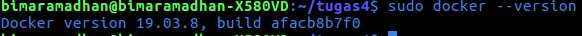
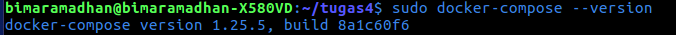
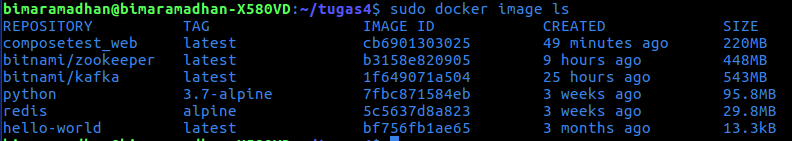
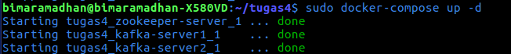
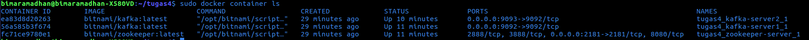
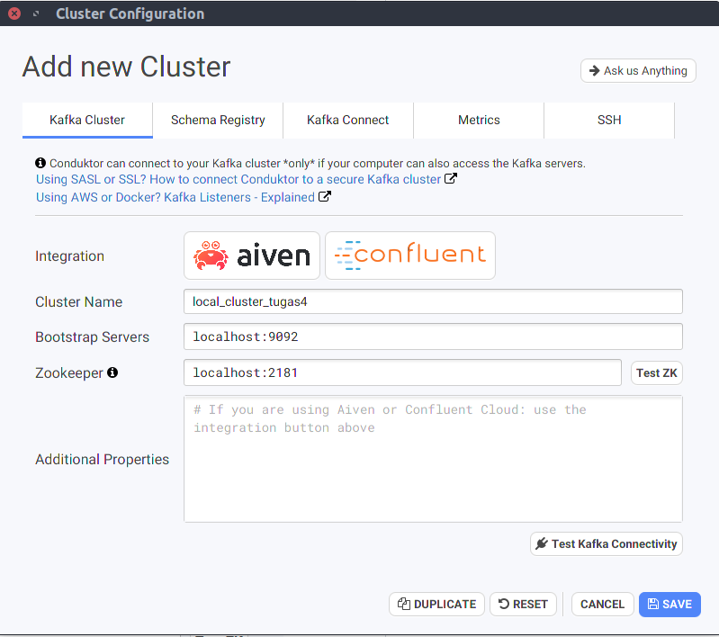
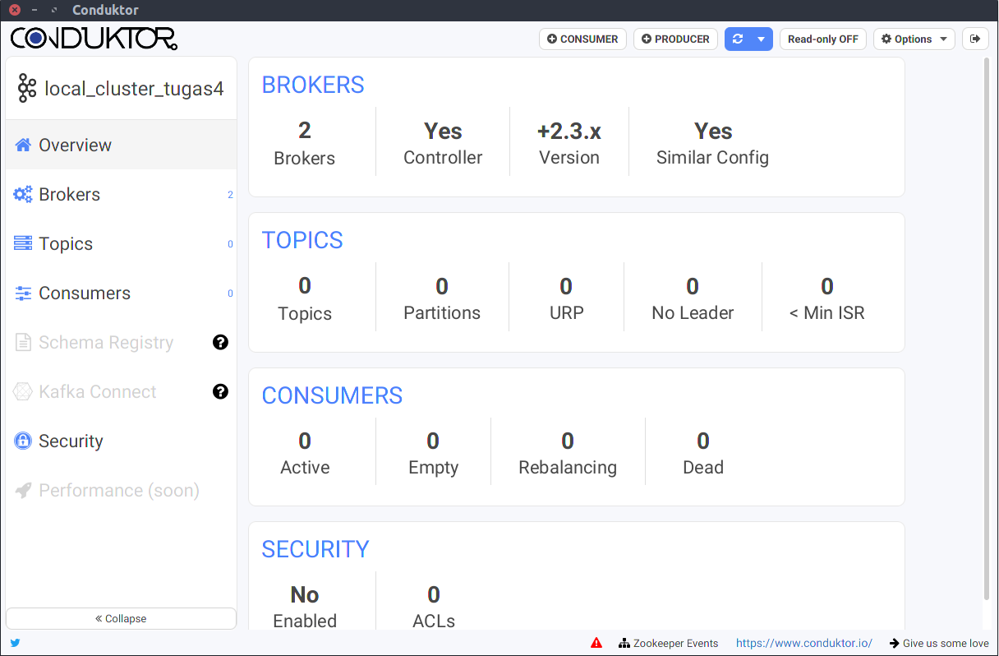

# Dokumentasi Implementasi Infrastruktur Kafka

## Daftar Isi
- [Tools](https://github.com/bimaramadhan/bigdata-its-2020/tree/master/tugas4#tools)
- [Langkah-langkah](https://github.com/bimaramadhan/bigdata-its-2020/tree/master/tugas4#langkah-langkah)
  - [1. Instal Docker Engine](https://github.com/bimaramadhan/bigdata-its-2020/tree/master/tugas4#1-instal-docker-engine)
  - [2. Instal Docker Compose](https://github.com/bimaramadhan/bigdata-its-2020/tree/master/tugas4#2-instal-docker-compose)
  - [3. Membuat file skrip Docker Compose](https://github.com/bimaramadhan/bigdata-its-2020/tree/master/tugas4#3-membuat-file-skrip-docker-compose)
  - [4. Melakukan perintah ```docker pull```](https://github.com/bimaramadhan/bigdata-its-2020/tree/master/tugas4#4-melakukan-perintah-docker-pull)
  - [5. Menjalankan perintah ```docker-compose up -d```](https://github.com/bimaramadhan/bigdata-its-2020/tree/master/tugas4#5-menjalankan-perintah-docker-compose-up--d)
  - [6. Instal Conduktor](https://github.com/bimaramadhan/bigdata-its-2020/tree/master/tugas4#6-instal-conduktor)
  - [7. Setting pada Conduktor](https://github.com/bimaramadhan/bigdata-its-2020/tree/master/tugas4#7-setting-pada-conduktor)
  - [8. Tampilan Overview Conduktor](https://github.com/bimaramadhan/bigdata-its-2020/tree/master/tugas4#8-tampilan-overview-conduktor)
  

## Tools
Terdapat beberapa tools yang akan digunakan yaitu :
1. Docker Engine, Docker pada perangkat linux
2. Kafka, yang dibuat akan berjalan di bawah manajemen Zookeeper
3. Zookeeper, digunakan sebagai cluster manager
4. Conduktor, Kafka desktop client (GUI) yang simpel dan powerful dan dapat dijalankan pada Mac OS X, Windows dan Linux

## Langkah-langkah
### 1. Instal Docker Engine
Disini sistem operasi yang dipakai adalah Linux Ubuntu. Jadi pertama lakukan instalasi docker pada ubuntu sesuai dengan petunjuk dari dokumentasi yang sudah disediakan pada website resmi docker. [Instalasi Docker Engine pada Ubuntu](https://docs.docker.com/engine/install/ubuntu/)

<br/>

### 2. Instal Docker Compose
Terdapat 2 metode dalam membuat infrastruktur kafka, yaitu Docker Command dan Docker Compose. Metode yang akan digunakan adalah dengan Docker Compose sehingga harus dilakukan instalasi untuk Docker Compose. [Instalasi Docker Compose](https://docs.docker.com/compose/install/)

<br/>

### 3. Membuat file skrip Docker Compose
Membuat sebuah file skrip dengan format ```docker-compose.yml``` untuk menentukan container apa saja yang akan dibuat. Saat dijalankan nantinya Docker akan secara otomatis membuatkan semua container sesuai dengan dependency yang kita tentukan.
```
version: '2'

networks:
  kafka-net:
    driver: bridge

services:
  zookeeper-server:
    image: 'bitnami/zookeeper:latest'
    networks:
      - kafka-net
    ports:
      - '2181:2181'
    environment:
      - ALLOW_ANONYMOUS_LOGIN=yes
  kafka-server1:
    image: 'bitnami/kafka:latest'
    networks:
      - kafka-net    
    ports:
      - '9092:9092'
    environment:
      - KAFKA_CFG_ZOOKEEPER_CONNECT=zookeeper-server:2181
      - KAFKA_CFG_ADVERTISED_LISTENERS=PLAINTEXT://localhost:9092
      - ALLOW_PLAINTEXT_LISTENER=yes
    depends_on:
      - zookeeper-server
  kafka-server2:
    image: 'bitnami/kafka:latest'
    networks:
      - kafka-net    
    ports:
      - '9093:9092'
    environment:
      - KAFKA_CFG_ZOOKEEPER_CONNECT=zookeeper-server:2181
      - KAFKA_CFG_ADVERTISED_LISTENERS=PLAINTEXT://localhost:9093
      - ALLOW_PLAINTEXT_LISTENER=yes
    depends_on:
      - zookeeper-server
```
### 4. Melakukan perintah ```docker pull``` 
Melakukan perintah tersebut pada image yang diperlukan yaitu **bitnami/zookeeper** dan **bitnami/kafka**. Pastikan sudah terdapat 2 Docker Image tersebut pada local environment

<br/>

### 5. Menjalankan perintah ```docker-compose up -d``` 
Jika 2 Docker Image tersebut sudah terinstal maka dapat dilakukan running dockerfile yang sudah kita buat pada langkah nomor 3

<br/>

Untuk berjaga-jaga lakukan pengecekan untuk mengetahui Docker Container sudah terbuat sesuai dengan yang diinginkan

<br/>

### 6. Instal Conduktor

Untuk melakukan testing Kafka dapat dilakukan dengan menggunakan tools Conduktor. Instalasi dan link download dapat dilihat pada web resmi Conduktor. [Instalasi Conduktor](https://www.conduktor.io/)

Berikut adalah tampilan awal aplikasi Conduktor

<br/>

### 7. Setting pada Conduktor
Lakukan pengaturan pada bagian Cluster Name, Bootstrap Servers, dan Zookeeper diisi sesuai dengan dependency Docker Container yang sudah diatur pada langkah sebelumnya 

<br/>

### 8. Tampilan Overview Conduktor
Jika sudah berhasil maka akan masuk pada menu overview yang seperti berikut  

<br/>
