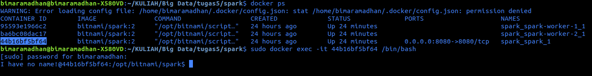

# Dokumentasi Create Apache Spark Cluster Menggunakan Docker

## Daftar Isi
- [Tools](https://github.com/bimaramadhan/bigdata-its-2020/tree/master/tugas5#tools)
- [Langkah-langkah](https://github.com/bimaramadhan/bigdata-its-2020/tree/master/tugas5#langkah-langkah)
- [Persiapan](https://github.com/bimaramadhan/bigdata-its-2020/tree/master/tugas5#persiapan)
- [Testing](https://github.com/bimaramadhan/bigdata-its-2020/tree/master/tugas5#testing)


## Tools
Terdapat beberapa tools yang akan digunakan yaitu :
1. Docker Engine, Docker pada perangkat linux
2. Apache Spark, Framework open source yang terutama digunakan untuk analisis Big Data, machine learning, dan real-time processing.

## Persiapan
Terdapat beberapa persiapan yang dilakukan diantaranya :
1. Karena dilakukan pada Docker maka perlu melakukan [Instalasi Docker Engine pada Ubuntu](https://docs.docker.com/engine/install/ubuntu/)
2. Selain itu karena akan digunakan docker image Apache Spark dari Bitnami alangkah baiknya untuk membaca [Dokumentasi Bitnami Spark](https://hub.docker.com/r/bitnami/spark)

## Langkah-langkah
Jika sudah maka dapat dilakukan implementasi berdasarkan pada langkah-langkah pada link berikut : <br>
[Tutorial Membuat Apache Spark Cluster Menggunakan Docker](https://docs.google.com/document/d/1LxGtV1WNKPKeUNwzRNJM7BKapAS1V_7ZWgeG9vwyfPY/edit#)

## Testing
Akan diakukan percobaan dengan parameter-parameter sebagai berikut:
- Jumlah worker: 2, 5
- Jumlah CPU: 2, 4
- Memory: 1G
- Partisi: 100, 1000

Untuk menambahkan worker, memodifikasi jumlah CPU dan memory, dapat dilakukan dengan melakukan modifikasi pada [docker-compose.yml](spark/docker-compose.yml) sesuai dengan parameter yang diinginkan

### Percobaan dengan 2 worker

1. Melakukan modifikasi pada file [docker-compose.yml](spark/docker-compose.yml) sehingga nampak seperti di bawah ini

```
version: '2'

services:
  spark:
    image: bitnami/spark:2
    environment:
      - SPARK_MODE=master
      - SPARK_RPC_AUTHENTICATION_ENABLED=no
      - SPARK_RPC_ENCRYPTION_ENABLED=no
      - SPARK_LOCAL_STORAGE_ENCRYPTION_ENABLED=no
      - SPARK_SSL_ENABLED=no
    ports:
      - '8080:8080'
  spark-worker-1:
    image: bitnami/spark:2
    environment:
      - SPARK_MODE=worker
      - SPARK_MASTER_URL=spark://spark:7077
      - SPARK_WORKER_MEMORY=1G
      - SPARK_WORKER_CORES=1
      - SPARK_RPC_AUTHENTICATION_ENABLED=no
      - SPARK_RPC_ENCRYPTION_ENABLED=no
      - SPARK_LOCAL_STORAGE_ENCRYPTION_ENABLED=no
      - SPARK_SSL_ENABLED=no
  spark-worker-2:
    image: bitnami/spark:2
    environment:
      - SPARK_MODE=worker
      - SPARK_MASTER_URL=spark://spark:7077
      - SPARK_WORKER_MEMORY=1G
      - SPARK_WORKER_CORES=1
      - SPARK_RPC_AUTHENTICATION_ENABLED=no
      - SPARK_RPC_ENCRYPTION_ENABLED=no
      - SPARK_LOCAL_STORAGE_ENCRYPTION_ENABLED=no
      - SPARK_SSL_ENABLED=no
```

2. Buka Terminal dan jalankan perintah berikut ```docker-compose up``` pada direktori tempat file docker-compose.yml berada untuk membuat container

<br/>

3. Pastikan Spark cluster telah terbuat dengan mengakses web UI di port 8080 (http://localhost:8080)

<br/>

4. Masuk ke dalam container dan mengeksekusi bash dengan menggunakan perintah berikut ```docker exec -it <container_id> /bin/bash``` untuk mengetahui id container dapat dilakukan perintah ```docker ps```

<br/>

5. Cek alamat IP dengan menggunakan perintah berikut ```hostname -i```

<br/>

6. Sebagai contoh jalankan script berikut ```spark-submit --master spark://172.18.0.4:7077 examples/src/main/python/pi.py 10``` yang mana script ini berisi program untuk menghitung estimasi nilai pi.
   - Partisi 100 <br>
     1. Jalankan perintah berikut untuk partisi sebanyak 100
     ```spark-submit --master spark://172.18.0.4:7077 examples/src/main/python/pi.py 100```
     
     2. Tunggu proses sampai selesai hingga menampilkan hasil nilai pi seperti berikut 
        <br/>
        
     3. Observasi jalannya aplikasi dapat dilihat dari Spark Web UI (http://localhost:8080). Dapat dilihat bahwa durasi waktu adalah 20 detik
        <br/>
        
   - Partisi 1000 <br>
     1. Jalankan perintah berikut untuk partisi sebanyak 100
     ```spark-submit --master spark://172.18.0.4:7077 examples/src/main/python/pi.py 1000```
     
     2. Tunggu proses sampai selesai hingga menampilkan hasil nilai pi seperti berikut 
        <br/>
        
     3. Observasi jalannya aplikasi dapat dilihat dari Spark Web UI (http://localhost:8080). Dapat dilihat bahwa durasi waktu adalah 20 detik
        <br/>

- ### Percobaan dengan 5 worker
  1. Melakukan modifikasi pada file [docker-compose.yml](spark/docker-compose.yml) sehingga nampak seperti di bawah ini
```
version: '2'

services:
  spark:
    image: bitnami/spark:2
    environment:
      - SPARK_MODE=master
      - SPARK_RPC_AUTHENTICATION_ENABLED=no
      - SPARK_RPC_ENCRYPTION_ENABLED=no
      - SPARK_LOCAL_STORAGE_ENCRYPTION_ENABLED=no
      - SPARK_SSL_ENABLED=no
    ports:
      - '8080:8080'
  spark-worker-1:
    image: bitnami/spark:2
    environment:
      - SPARK_MODE=worker
      - SPARK_MASTER_URL=spark://spark:7077
      - SPARK_WORKER_MEMORY=1G
      - SPARK_WORKER_CORES=1
      - SPARK_RPC_AUTHENTICATION_ENABLED=no
      - SPARK_RPC_ENCRYPTION_ENABLED=no
      - SPARK_LOCAL_STORAGE_ENCRYPTION_ENABLED=no
      - SPARK_SSL_ENABLED=no
  spark-worker-2:
    image: bitnami/spark:2
    environment:
      - SPARK_MODE=worker
      - SPARK_MASTER_URL=spark://spark:7077
      - SPARK_WORKER_MEMORY=1G
      - SPARK_WORKER_CORES=1
      - SPARK_RPC_AUTHENTICATION_ENABLED=no
      - SPARK_RPC_ENCRYPTION_ENABLED=no
      - SPARK_LOCAL_STORAGE_ENCRYPTION_ENABLED=no
      - SPARK_SSL_ENABLED=no
  spark-worker-3:
    image: bitnami/spark:2
    environment:
      - SPARK_MODE=worker
      - SPARK_MASTER_URL=spark://spark:7077
      - SPARK_WORKER_MEMORY=1G
      - SPARK_WORKER_CORES=1
      - SPARK_RPC_AUTHENTICATION_ENABLED=no
      - SPARK_RPC_ENCRYPTION_ENABLED=no
      - SPARK_LOCAL_STORAGE_ENCRYPTION_ENABLED=no
      - SPARK_SSL_ENABLED=no
  spark-worker-4:
    image: bitnami/spark:2
    environment:
      - SPARK_MODE=worker
      - SPARK_MASTER_URL=spark://spark:7077
      - SPARK_WORKER_MEMORY=1G
      - SPARK_WORKER_CORES=1
      - SPARK_RPC_AUTHENTICATION_ENABLED=no
      - SPARK_RPC_ENCRYPTION_ENABLED=no
      - SPARK_LOCAL_STORAGE_ENCRYPTION_ENABLED=no
      - SPARK_SSL_ENABLED=no
  spark-worker-5:
    image: bitnami/spark:2
    environment:
      - SPARK_MODE=worker
      - SPARK_MASTER_URL=spark://spark:7077
      - SPARK_WORKER_MEMORY=1G
      - SPARK_WORKER_CORES=1
      - SPARK_RPC_AUTHENTICATION_ENABLED=no
      - SPARK_RPC_ENCRYPTION_ENABLED=no
      - SPARK_LOCAL_STORAGE_ENCRYPTION_ENABLED=no
      - SPARK_SSL_ENABLED=no
```

<br/>

- ### Percobaan 3

<br/>

- ### Percobaan 4

<br/>

- ### Percobaan 5

<br/>
