# Dokumentasi MLlib model to PMML (KNIME)

# Daftar Isi
- [Business Understanding](https://github.com/bimaramadhan/bigdata-its-2020/tree/master/tugas6/MLlib%20model%20to%20PMML#business-understanding)
- [Data Understanding](https://github.com/bimaramadhan/bigdata-its-2020/tree/master/tugas6/MLlib%20model%20to%20PMML#data-understanding)
- [Data Preparation](https://github.com/bimaramadhan/bigdata-its-2020/tree/master/tugas6/MLlib%20model%20to%20PMML#data-preparation)
- [Modeling](https://github.com/bimaramadhan/bigdata-its-2020/tree/master/tugas6/MLlib%20model%20to%20PMML#modeling)
- [Evaluation](https://github.com/bimaramadhan/bigdata-its-2020/tree/master/tugas6/MLlib%20model%20to%20PMML#evaluation)
- [Deployment](https://github.com/bimaramadhan/bigdata-its-2020/tree/master/tugas6/MLlib%20model%20to%20PMML#deployment)
- [Workflow KNIME](https://github.com/bimaramadhan/bigdata-its-2020/tree/master/tugas6/MLlib%20model%20to%20PMML#workflow-knime)

# Business Understanding
Kemungkinan proses yang dapat dilakukan pada dataset ini antara lain :
- Klasifikasi spesies bunga iris dengan berbagai algoritma
- Latihan untuk mencoba machine learning
- Data pembelajaran untuk data mining

# Data Understanding

Dataset Iris adalah kumpulan data multivariat yang diperkenalkan oleh ahli statistik dan biolog Inggris Ronald Fisher dalam makalahnya tahun 1936 "The Use of Multiple Measurements in Taxonomic Problems."  Dataset ini adalah salah satu yang paling populer untuk latihan machine learning. Dataset ini isinya tentang 3 macam spesies bunga beserta ukuran petal dan sepal.

  

1. sepal length in cm
2. sepal width in cm
3. petal length in cm
4. petal width in cm
5. class:
    - Iris Setosa
    - Iris Versicolour
    - Iris Virginica

- Sumber : [Iris Dataset](https://archive.ics.uci.edu/ml/datasets/Iris)

# Data Preparation

- Pertama membuat spark context menggunakan node **Create Local Big Data Environment**
 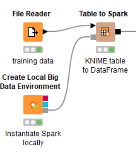 
- Melakukan konfigurasi pada node tersebut
 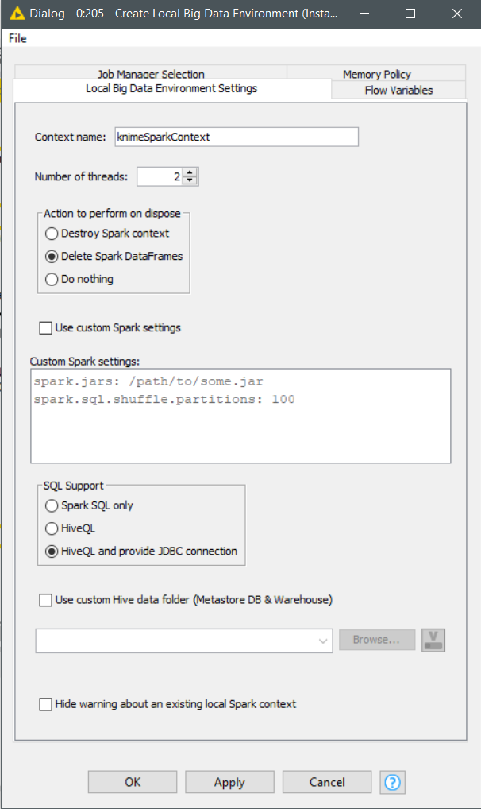 
- Kemudian membaca file dataset iris dengan node **File Reader** lalu melakukan konfigurasi 
 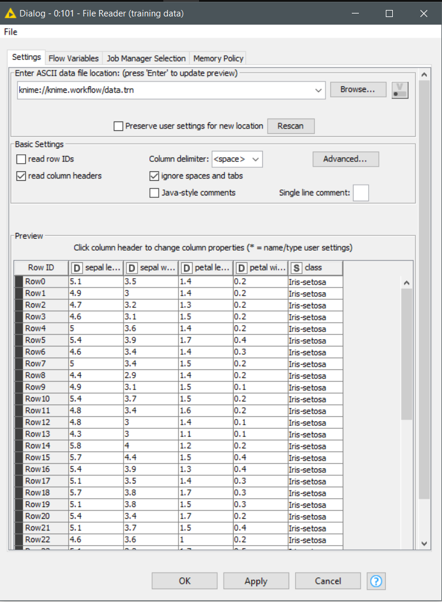 
- Menambahkan node **Table to Spark** untuk membuat sebuah spark dataframe dari tabel dataset iris yang sudah dibaca

# Modeling

- Melatih model pada spark dengan menggunakan node **Spark k-Means** 
 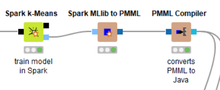 
- Melakukan konfigurasi pada node tersebut dan masukkan semua parameter
 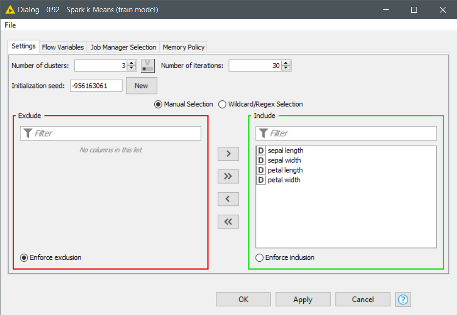 
- Menambahkan node **Spark MLlib to PMML** untuk mengubah model dari spark menjadi pmml
- Menambahkan node **PMML Compiler** untuk menerjemahkan model pmml ke java bytecode agar bisa dijalankan oleh node **Compiled Model Predictor** nantinya
 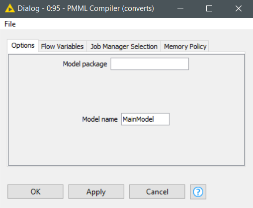 

# Evaluation

- Kemudian pertama membaca file dataset iris yang sudah disiapkan untuk testing
 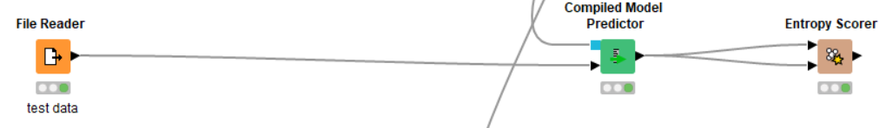 
- Melakukan konfigurasi pada node tersebut
 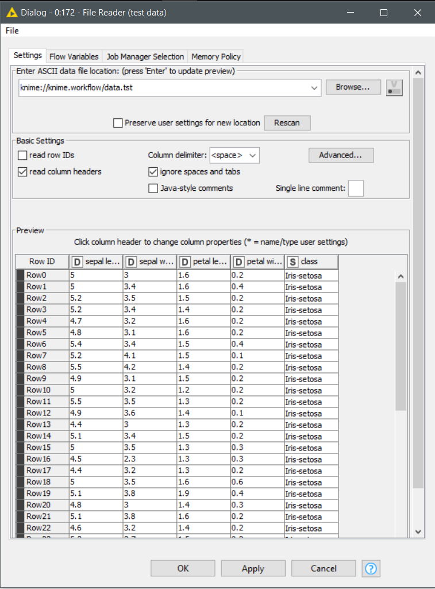 
- Menambahkan node **Compiled Model Predictor** dan melakukan konfigurasi jika diperlukan
 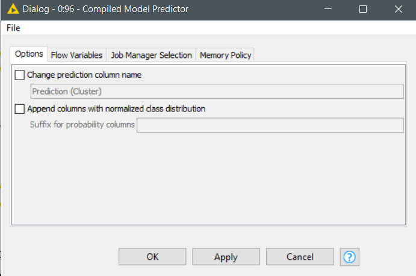 
- Melakukan perhitungan scoring dengan node **Entropy Scorer** 
 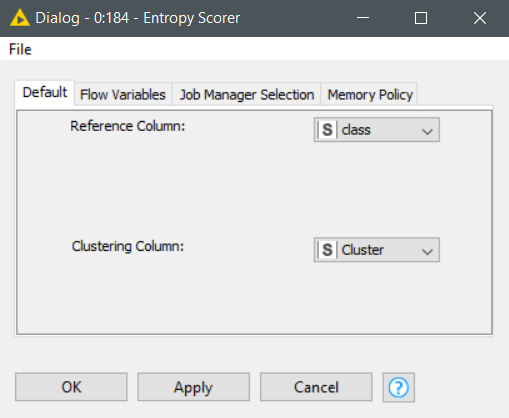 
- Berikut hasil perhitungan scoring yang dilakukan
 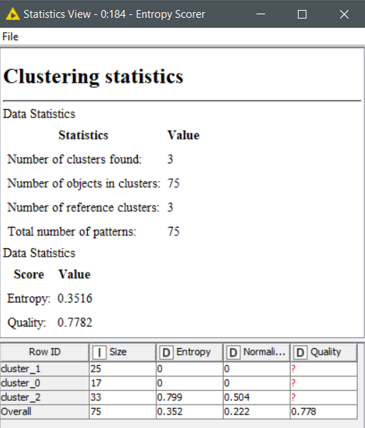  

# Deployment

- Memasukan nilai JSON baru menggunakan node **Container Input (JSON)**
 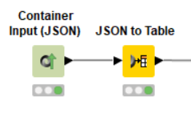  
- Melakukan konfigurasi node **Container Input (JSON)** dengan memasukkan input nilai JSON sesuai yang diinginkan
 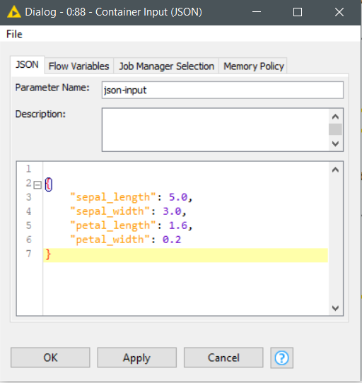  
- Menambahkan node **JSON to Table** untuk mengubah dari bentuk JSON menjadi tabel multi kolom  
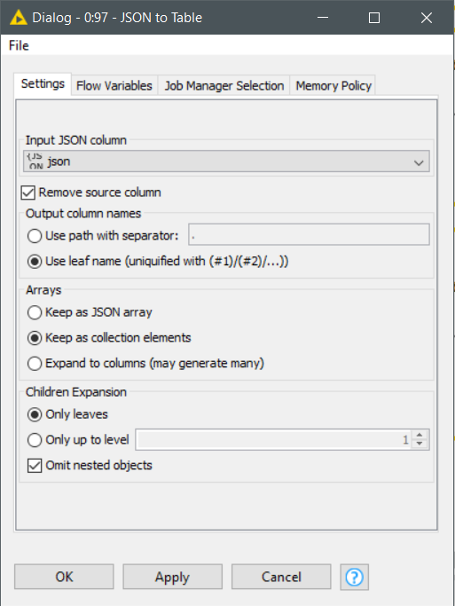  
- Menambahkan node **Compiled Model Predictor** 
 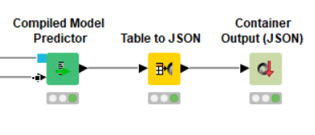 
- Melakukan konfigurasi jika diperlukan
  
- Menambahkan node **Table to JSON** untuk mengubah kembali dari bentuk tabel multi kolom ke bentuk kolom JSON dan disatukan dalam satu kolom cluster
 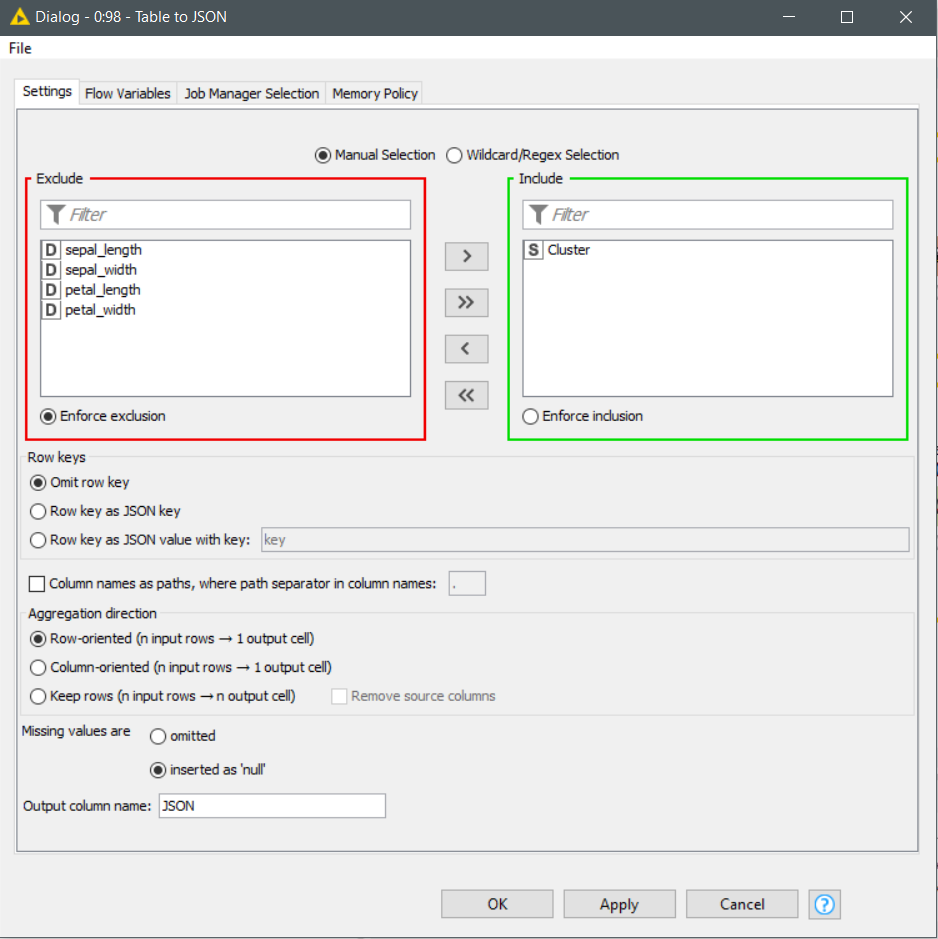  
- Menambahkan node **Container Output (JSON)** untuk membaca isi kolom JSON kemudian lakukan konfigurasi
 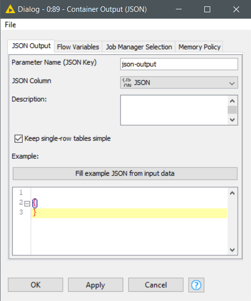  
- Berikut hasil dimana terbaca dan terdapat sebuah cluster 
 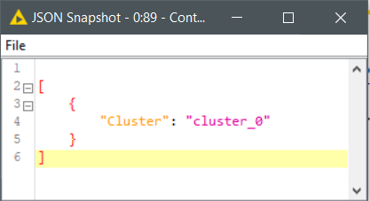  

# Workflow KNIME
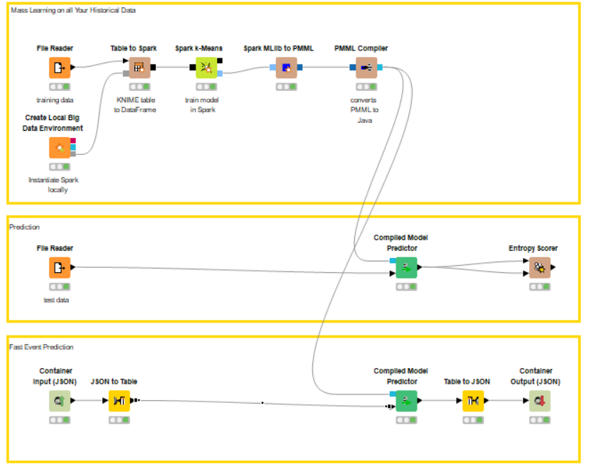 
