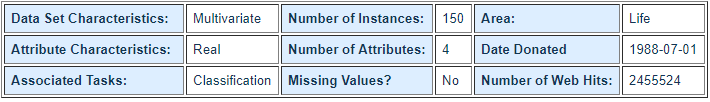

# Dokumentasi MLlib model to PMML (KNIME)

# Daftar Isi
- [Business Understanding](https://github.com/bimaramadhan/bigdata-its-2020/tree/master/tugas6/MLlib%20model%20to%20PMML#business-understanding)
- [Data Understanding](https://github.com/bimaramadhan/bigdata-its-2020/tree/master/tugas6/MLlib%20model%20to%20PMML#data-understanding)
- [Data Preparation](https://github.com/bimaramadhan/bigdata-its-2020/tree/master/tugas6/MLlib%20model%20to%20PMML#data-preparation)
- [Modeling](https://github.com/bimaramadhan/bigdata-its-2020/tree/master/tugas6/MLlib%20model%20to%20PMML#modeling)
- [Evaluation](https://github.com/bimaramadhan/bigdata-its-2020/tree/master/tugas6/MLlib%20model%20to%20PMML#evaluation)
- [Deployment](https://github.com/bimaramadhan/bigdata-its-2020/tree/master/tugas6/MLlib%20model%20to%20PMML#deployment)
- [Workflow KNIME](https://github.com/bimaramadhan/bigdata-its-2020/tree/master/tugas6/MLlib%20model%20to%20PMML#workflow-knime)

# Business Understanding
Kemungkinan proses yang dapat dilakukan pada dataset ini antara lain :
- Klasifikasi spesies bunga iris dengan berbagai algoritma
- Latihan untuk mencoba machine learning
- Data pembelajaran untuk data mining

# Data Understanding

Dataset Iris adalah kumpulan data multivariat yang diperkenalkan oleh ahli statistik dan biolog Inggris Ronald Fisher dalam makalahnya tahun 1936 "The Use of Multiple Measurements in Taxonomic Problems."  Dataset ini adalah salah satu yang paling populer untuk latihan machine learning. Dataset ini isinya tentang 3 macam spesies bunga beserta ukuran petal dan sepal.

  

1. sepal length in cm
2. sepal width in cm
3. petal length in cm
4. petal width in cm
5. class:
    - Iris Setosa
    - Iris Versicolour
    - Iris Virginica

- Sumber : [Iris Dataset](https://archive.ics.uci.edu/ml/datasets/Iris)

# Data Preparation

- Pertama membuat spark context menggunakan node **Create Local Big Data Environment**
  

- Melakukan konfigurasi pada node tersebut
  

- Kemudian disini membangun profil user dengan id misal adalah 999999 untuk menilai 20 film acak
  
- Melakukan konfigurasi pada node **File Reader** untuk membaca data movies.csv
  
- Menambahkan node **add fields**. Didalam **add fields** terdapat beberapa proses seperti gambar di bawah ini
  
  - node **Shuffle** untuk mengacak urutan baris pada data
  - melakukan konfigurasi pada node **Constant Value Column** untuk menambahkan kolom timestamp=123 dan userID=999999
    
    
- Melakukan konfigurasi pada node **Row Splitter** untuk mengambil 20 film yang akan dinilai oleh user sedangkan film sisanya nanti akan digunakan saat proses **Deployment**
  
- Menambahkan node **no rating** yang di dalamnya terdapat beberapa node seperti berikut
  
- Proses pada node tersebut untuk menyiapkan data saat **Deployment** nanti
- Kemudian menambahkan node **Ask User for Movie Ratings** yang mana terdapat beberapa node di dalamnya yang intinya adalah untuk memberikan rating pada 20 film yang sudah diambil
  
- Berikut hasilnya jika kita klik interactive view
  
- Menambahkan node **Table to Spark** untuk membuat dataframe spark dari data table yang sudah ada rating dari user untuk digunakan saat proses **Training**
  
- Proses selanjutnya yaitu membaca file ratings.csv dengan node **CSV to Spark** untuk kemudian digunakan saat proses **Training**
  
- Melakukan konfigurasi pada node **CSV to Spark** untuk membuat dataframe spark dari file ratings.csv
  
- Melakukan konfigurasi pada node **Spark Partitioning** untuk mempartisi file dan menggunakan 80% untuk **Training** dan 20% untuk **Testing**
  

# Modeling

- Proses **Modeling** diawali dengan menggabungkan dua data menggunakan node **Spark Concatenate** yaitu data rating dan data film yang sudah diberi rating oleh user dengan konfigurasi training set=80% original movies + 20 movies rated by user
  
- Lalu Menambahkan node **Spark Collaborative Filtering Learner (MLlib)** dan lakukan konfigurasi untuk training dengan model algoritma ALS 
  

# Evaluation

- Kemudian melakukan **Testing** untuk Proses **Evaluasi** model dengan test set=20% original movies yang didapat dari proses partisi node **Spark Partitioning** 
  
- Melakukan konfigurasi node **Spark Predictor (MLlib)** untuk melakukan prediksi rating pada test set dan meletakkannya pada kolom prediction
  
- Berikut tampilan contoh hasil dari prediksi pada test set
  
- Melakukan konfigurasi pada node **Spark Missing Value** untuk menghapus NaN dan prediksi yang kosong
  
- Melakukan konfigurasi pada node **Spark Numeric Scorer** menghitung kesalahan numerik antara original ratings dan predicted ratings
  
- Berikut hasil perhitungan dapat dilihat pada gambar di bawah
   

# Deployment

- Terakhir yaitu proses **Deployment** untuk membuat prediksi 20 terbaik film untuk user
   
- Pertama menambahkan node **Table to Spark** untuk membuat dataframe spark dari data film sisa yang tidak diambil dan tidak diberikan rating oleh user pada step **Data Preparation**. Data ini digunakan untuk proses prediksi pada node **Spark Predictor (MLlib)** langkah selanjutnya
   
- Melakukan konfigurasi node **Spark Predictor (MLlib)** untuk melakukan prediksi rating pada unrated movies dan meletakkannya pada kolom prediction
   
- Menambahkan node **Spark to Table** untuk memuat data dari dataframe spark ke data table 
- Menambahkan node **Top 20 recommended movies** yang di dalamnya terdapat node-node seperti berikut
   
- Proses pada node-node di atas adalah untuk mengurutkan rekomendasi film berdasarkan rating yang terbaik dan mengekstraknya sebanyak 20 film terbaik
- Menambahkan node **Display Recommendations** yang mana terdapat beberapa node di dalamnya
   
- Fungsi node tersebut adalah untuk menampilkan daftar film yang direkomendasikan pada portal web dan hasilnya adalah seperti berikut
   
- Menambahkan node **CSV Writer** dan melakukan konfigurasi untuk menyimpannya dalam bentuk file csv
   
- Berikut file telah terbuat
   

# Workflow KNIME
 
