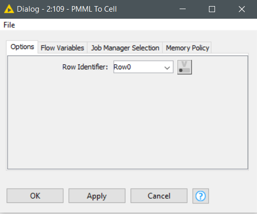
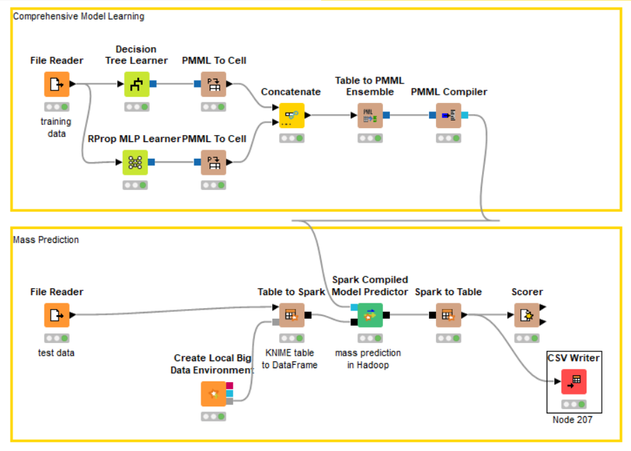

# Dokumentasi Spark Compiled Model Predictor (KNIME)

# Daftar Isi
- [Business Understanding](https://github.com/bimaramadhan/bigdata-its-2020/tree/master/tugas6/Spark%20Compiled%20Model%20Predictor#business-understanding)
- [Data Understanding](https://github.com/bimaramadhan/bigdata-its-2020/tree/master/tugas6/Spark%20Compiled%20Model%20Predictor#data-understanding)
- [Data Preparation](https://github.com/bimaramadhan/bigdata-its-2020/tree/master/tugas6/Spark%20Compiled%20Model%20Predictor#data-preparation)
- [Modeling](https://github.com/bimaramadhan/bigdata-its-2020/tree/master/tugas6/Spark%20Compiled%20Model%20Predictor#modeling)
- [Evaluation](https://github.com/bimaramadhan/bigdata-its-2020/tree/master/tugas6/Spark%20Compiled%20Model%20Predictor#evaluation)
- [Deployment](https://github.com/bimaramadhan/bigdata-its-2020/tree/master/tugas6/Spark%20Compiled%20Model%20Predictor#deployment)
- [Workflow KNIME](https://github.com/bimaramadhan/bigdata-its-2020/tree/master/tugas6/Spark%20Compiled%20Model%20Predictor#workflow-knime)

# Business Understanding
Kemungkinan proses yang dapat dilakukan pada dataset ini antara lain :
- Klasifikasi spesies bunga iris dengan berbagai algoritma
- Latihan untuk mencoba machine learning
- Data pembelajaran untuk data mining

# Data Understanding

Dataset Iris adalah kumpulan data multivariat yang diperkenalkan oleh ahli statistik dan biolog Inggris Ronald Fisher dalam makalahnya tahun 1936 "The Use of Multiple Measurements in Taxonomic Problems."  Dataset ini adalah salah satu yang paling populer untuk latihan machine learning. Dataset ini isinya tentang 3 macam spesies bunga beserta ukuran petal dan sepal.

  

1. sepal length in cm
2. sepal width in cm
3. petal length in cm
4. petal width in cm
5. class:
    - Iris Setosa
    - Iris Versicolour
    - Iris Virginica

- Sumber : [Iris Dataset](https://archive.ics.uci.edu/ml/datasets/Iris)

# Data Preparation

- Pertama membaca file dataset iris dengan node **File Reader**  
  
- Melakukan konfigurasi pada node tersebut
  
- Kemudian menambahkan node **Decision Tree Learner** dan lakukan konfigurasi
  
- Kemudian menambahkan node **RProp MLP Learner** dan lakukan konfigurasi
  
- Hubungkan kedua node learner tersebut dengan node **PMML to Cell** untuk mengubah pmml port menjadi tabel yang berisi pmml cell

- Melakukan konfigurasi pada node tersebut dengan memberikan row identifier sebagai row0
  

# Modeling

- Menggabungkan model dengan dua learner yang berbeda dengan node **Concatenate** 
  
- Melakukan konfigurasi pada node tersebut 
  
- Menambahkan node **Table to PMML Ensemble** untuk menggabungkan tabel dokumen pmml menjadi satu dokumen pmml dengan model mining
  
- Menambahkan node **PMML Compiler** untuk menerjemahkan model pmml ke java bytecode agar bisa dijalankan oleh node **Compiled Model Predictor** nantinya
  

# Evaluation

- Kemudian pertama membaca file dataset iris yang sudah disiapkan untuk testing
  
- Melakukan konfigurasi pada node tersebut
  
- Lalu membuat spark context menggunakan node **reate Local Big Data Environment** dan lakukan konfigurasi
  
- Menambahkan node **Table to Spark** untuk membuat spark dataframe dari tabel data

- Menambahkan node **Compiled Model Predictor** dan lakukan konfigurasi dan mengubah kolom prediksi seperti gambar di bawah
  
- Menambahkan node **Spark to Table** untuk memuat data dari spark dataframe menjadi sebuah tabel data 
  
- Menambahkan node **Scorer** untuk melakukan perhitungan
   
- Berikut hasil perhitungan scoring yang dilakukan
   

# Deployment

- Menambahkan node **CSV Writer** untuk deploy output dalam bentuk csv
   
- Berikut hasilnya
   

# Workflow KNIME
 
